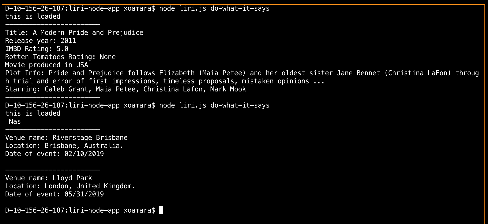

# liri-node-app

LIRI is a _Language_ Interpretation and Recognition Interface. LIRI will be a command line node app that takes in parameters and gives you back data.

liri.js can take in one of the following commands:

   * `concert-this`

   * `spotify-this-song`

   * `movie-this`

   * `do-what-it-says`

### Command Line Examples

`node liri.js concert-this 'Nas'`


`node liri.js movie-this 'Interstellar'`


`node liri.js spotify-this-song 'Sexyback'`


`node liri.js do-what-it-says`


### Dependencies and Requirements to run Liribot

The following are required to run Liritbot

  * axios
  * dotenv
  * inquirer
  * moment 
  * spotify api - requires your own API key
  * random-item
  * request 


### Spotify API key instructions
Create a file named `.env` in the running directory, add the following to it, replacing the values with your API keys (no quotes) once you have them:

```js
# Spotify API keys

SPOTIFY_ID=your-spotify-id
SPOTIFY_SECRET=your-spotify-secret

```

