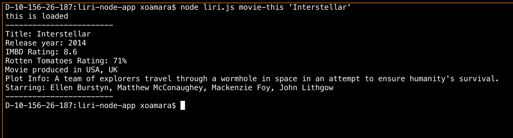
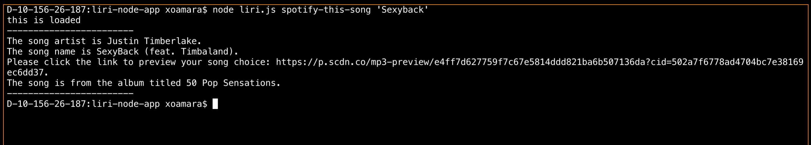

# liri-node-app

LIRI is a _Language_ Interpretation and Recognition Interface. LIRI will be a command line node app that takes in parameters and gives you back data.

liri.js can take in one of the following commands:

   * `concert-this`

   * `spotify-this-song`

   * `movie-this`

   * `do-what-it-says`

### Command Line Examples

`node liri.js concert-this 'Nas'`

`node liri.js movie-this 'Interstellar'`

`node liri.js spotify-this-song 'Sexyback'`

